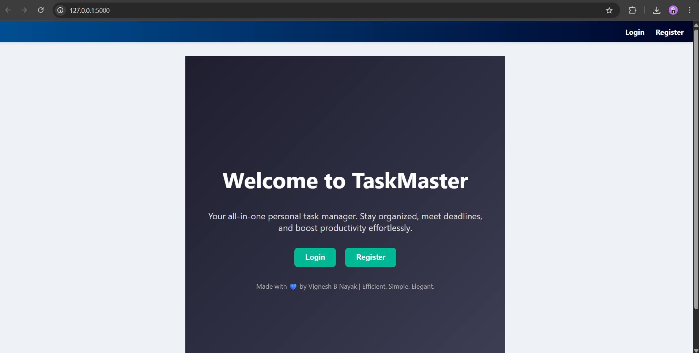
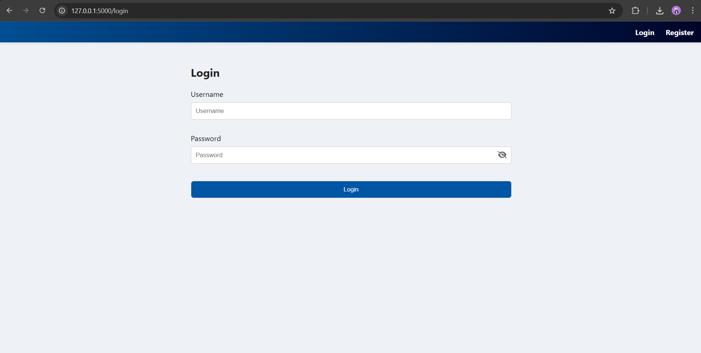
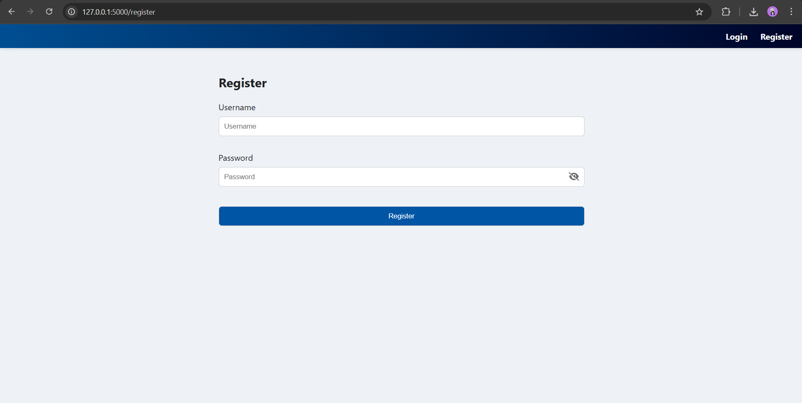
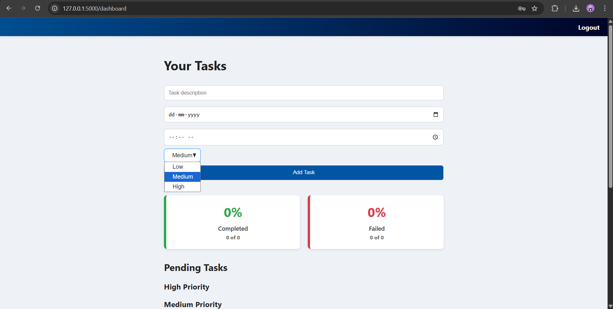
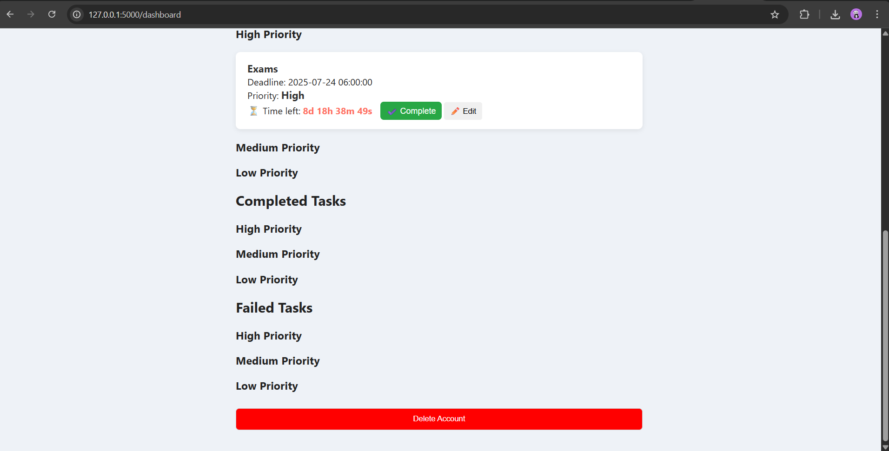
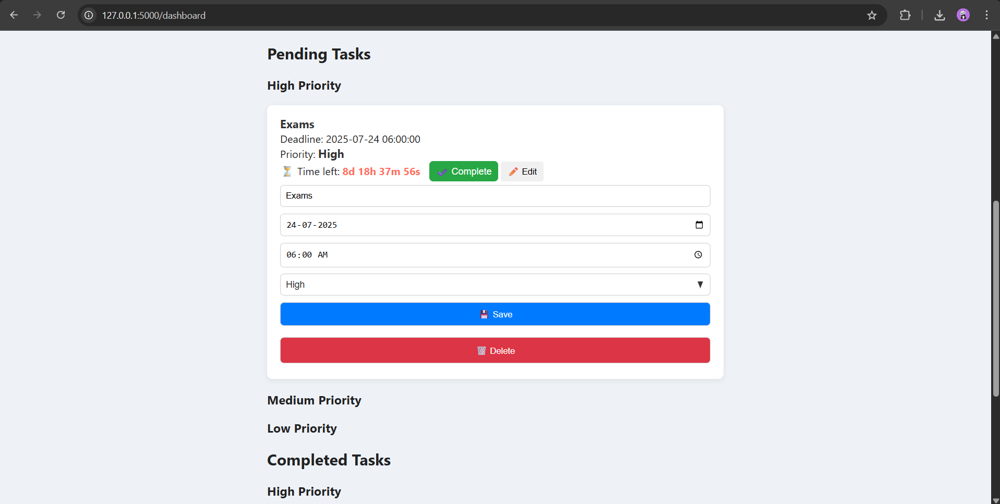

# 📝 Flask Task Manager

A sleek and powerful web app built with Flask to manage tasks, deadlines, and user stats.

## 🚀 Features

- ✅ User registration and login
- 🗓️ Add tasks with countdown timers
- 📊 View completion and failure stats
- 🎨 Responsive layout with custom styling
- 🔒 Secure account deletion

## 🧰 Tech Stack

- Python & Flask
- HTML, CSS, JavaScript
- SQLite + SQLAlchemy
- Flask-Login

## 📂 Folder Structure
project/ 
├── app.py 
├── models.py 
├── templates/ 
│   ├── index.html    
|   ├── login.html 
|   ├── base.html
|   ├── landing.html
|   └── register.html 
|── static/ 
│   ├── style.css 
│   └── countdown.js 
├── instance/ 
│   └── todo.db (ignored by .gitignore) 
├── .gitignore 
├── README.md 
├── screenshots/ 
│   ├── dashboard1.png
│   ├── dashboard2.png    
|   ├── landingpage.png
|   ├── loginpage.png
|   ├── registerpage.png
|   └── editpage.png
 
## 📸 Screenshots

### 🧭 Landing Page

### 🔐 Login Page

### 📝 Register Page

### 🧮 Dashboard Views

### ✏️ Edit Task Page
